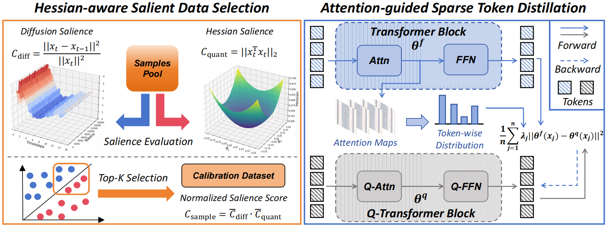
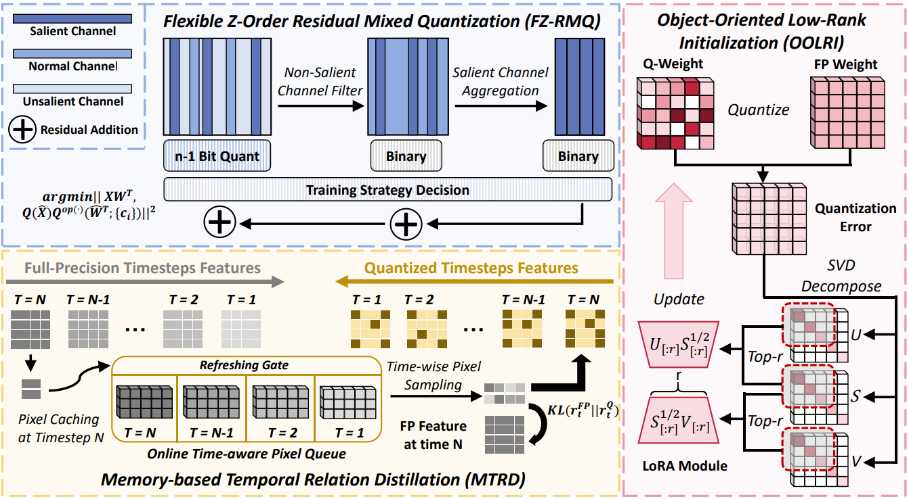
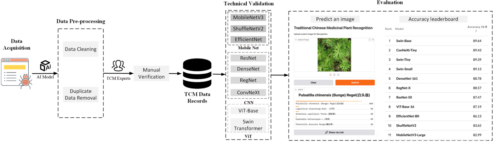
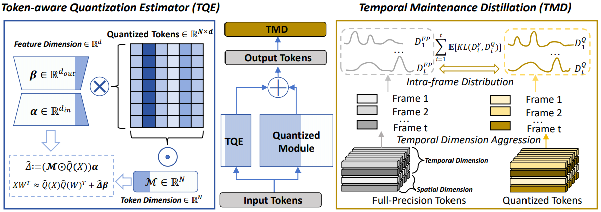
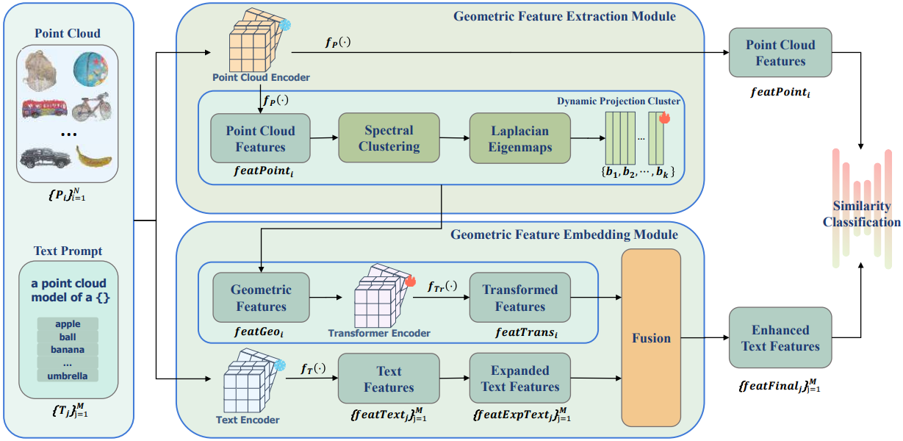
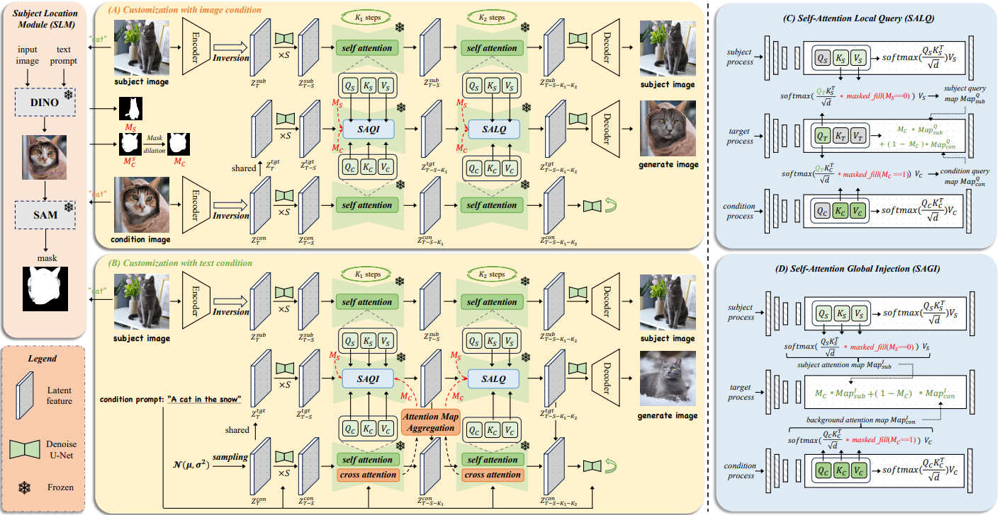
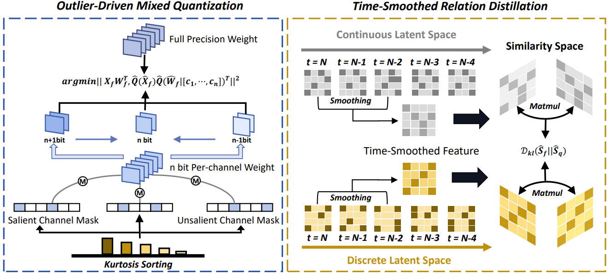
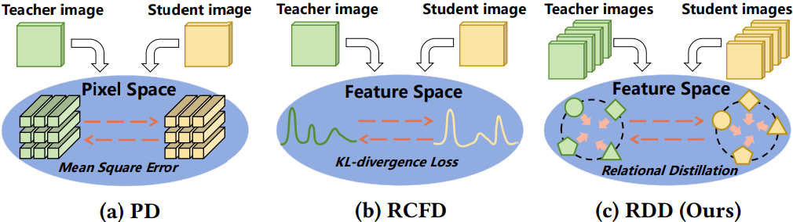
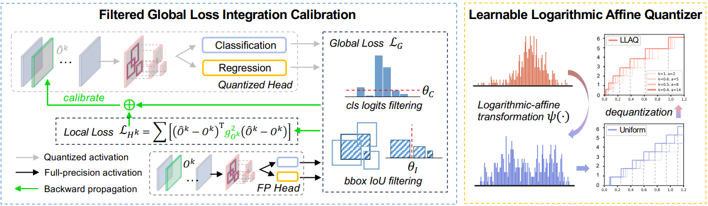








Hi, I am Weilun Feng. I am currently a **master** student at [Institute of Computing Technology, Chinese Academy of Sciences (ICT, CAS)](https://www.ict.ac.cn/) (2024.9 -- now). I obtained my B.E. degree from Shen Yuan Honors College, Beihang University (2020.9 -- 2024.7).

My research interests focus on **efficient machine learning**. Specifically, I focus on deep model compression (e.g., binarization, quantization, and distillation), efficient generative models (e.g., efficient large language models and diffusion models). 

# 🔥 News
- *2025.09*: &nbsp;🎉 One first-author paper was accepted by **NeurIPS 2025**.
- *2025.07*: &nbsp;🎉 One co-author paper about Traditional Chinese Medicinal Plant Dataset was accepted by **Scientific Data**.
- *2025.05*: &nbsp;🎉 One first-author paper and one co-author paper were accepted by **ICML 2025**.
- *2025.02*: &nbsp;🎉 One co-author paper was accepted by **CVPR 2025**.
- *2025.01*: &nbsp;🎉 One first-author paper was accepted by **AAAI 2025** *(Oral, top 4.63%)*.
- *2024.07*: &nbsp;🎉 One first-author paper was accepted by **ACM MM 2024** *(Oral, top 3.97%)*.
- *2024.02*: &nbsp;🎉 One co-author paper was accepted by **CVPR 2024**.

# 📝 Publications

NeurIPS 2025

  
[S$^2$Q-VDiT: Accurate Quantized Video Diffusion Transformer with Salient Data and Sparse Token Distillation](https://arxiv.org/abs/2508.04016)

**Weilun Feng**, Haotong Qin, Chuanguang Yang, Xiangqi Li, Han Yang, Yuqi Li, Zhulin An, Libo Huang, Michele Magno, Yongjun Xu

- *Accepted at Thirty-ninth Annual Conference on Neural Information Processing Systems (NeurIPS, CCF-A) 2025* Poster

Arxiv Preprint

  
[MPQ-DMv2: Flexible Residual Mixed Precision Quantization for Low-Bit Diffusion Models with Temporal Distillation](https://arxiv.org/abs/2507.04290)

**Weilun Feng**, Chuanguang Yang, Haotong Qin, Yuqi Li, Xiangqi Li, Zhulin An, Libo Huang, Boyu Diao, Fuzhen Zhuang, Michele Magno, Yongjun Xu, Yingli Tian, Tingwen Huang

- *Arxiv Preprint*

Scientific Data

  
[TCMP-300: A Comprehensive Traditional Chinese Medicinal Plant Dataset for Plant Recognition](https://www.nature.com/articles/s41597-025-05522-7)

Yanling Zhang, Wanhui Sun, Chuanguang Yang, Libo Huang, Zhulin An, **Weilun Feng**, Wenjing Tang, Yongjun Xu

- *Accepted at Scientific Data* Journal

ICML 2025

  
[Q-VDiT: Towards Accurate Quantization and Distillation of Video-Generation Diffusion Transformers](https://arxiv.org/abs/2505.22167)

**Weilun Feng**, Chuanguang Yang, Haotong Qin, Xiangqi Li, Yu Wang, Zhulin An, Libo Huang, Boyu Diao, Zixiang Zhao, Yongjun Xu, Michele Magno

- *Accepted at Forty-second International Conference on Machine Learning (ICML, CCF-A) 2025* Poster

ICML 2025

  
[Geometric Feature Embedding for Effective 3D Few-Shot Class Incremental Learning](https://openreview.net/forum?id=CuASYs6XZW)

Xiangqi Li, Libo Huang, Zhulin An, **Weilun Feng**, Chuanguang Yang, Boyu Diao, Fei Wang, Yongjun Xu

- *Accepted at Forty-second International Conference on Machine Learning (ICML, CCF-A) 2025* Poster

CVPR 2025

  
[Multi-party Collaborative Attention Control for Image Customization](https://arxiv.org/abs/2505.01428)

Han Yang, Chuanguang Yang, Qiuli Wang, Zhulin An, **Weilun Feng**, Libo Huang, Yongjun Xu

- *Accepted at Proceedings of the IEEE/CVF Conference on Computer Vision and Pattern Recognition (CVPR, CCF-A) 2025* Poster

AAAI 2025

  
[MPQ-DM: Mixed Precision Quantization for Extremely Low Bit Diffusion Models](https://arxiv.org/abs/2412.11549)

**Weilun Feng**, Haotong Qin, Chuanguang Yang, Zhulin An, Libo Huang, Boyu Diao, Fei Wang, Renshuai Tao, Yongjun Xu, Michele Magno

- *Accepted at Proceedings of the AAAI Conference on Artificial Intelligence (AAAI, CCF-A) 2025* Oral

ACM MM 2024

[Relational Diffusion Distillation for Efficient Image Generation](https://arxiv.org/abs/2410.07679)

**Weilun Feng**, Chuanguang Yang, Zhulin An, Libo Huang, Boyu Diao, Fei Wang, Yongjun Xu

- *Accepted at Proceedings of the 32nd ACM international conference on multimedia (ACM MM, CCF-A) 2024* Oral

CVPR 2024

[Reg-PTQ: Regression-specialized Post-training Quantization for Fully Quantized Object Detector](https://openaccess.thecvf.com/content/CVPR2024/html/Ding_Reg-PTQ_Regression-specialized_Post-training_Quantization_for_Fully_Quantized_Object_Detector_CVPR_2024_paper.html)

Yifu Ding, **Weilun Feng**, Chuyan Chen, Jinyang Guo, Xianglong Liu

- *Accepted at Proceedings of the IEEE/CVF Conference on Computer Vision and Pattern Recognition (CVPR, CCF-A) 2024* Poster

# 🎖 Honors and Awards
- *2025.05*: &nbsp;💰 E Fund Financial Technology Freshmen Scholarship （易方达金融科技新生奖学金）
- *2024.07*: &nbsp;🎖 Outstanding graduates of Beihang University

# 📖 Educations
- *2024.09 – Present*: &nbsp;🇨🇳 **Institute of Computing Technology, Chinese Academy of Sciences**
  
  *- Major: Computer Science and Technology*

- *2020.09 – 2024.07*: &nbsp;🇨🇳 **Shen Yuan Honors College, Beihang University**
  
  *- Bachelor of Engineering in Software Engineering*

# 💼 Services
- 

